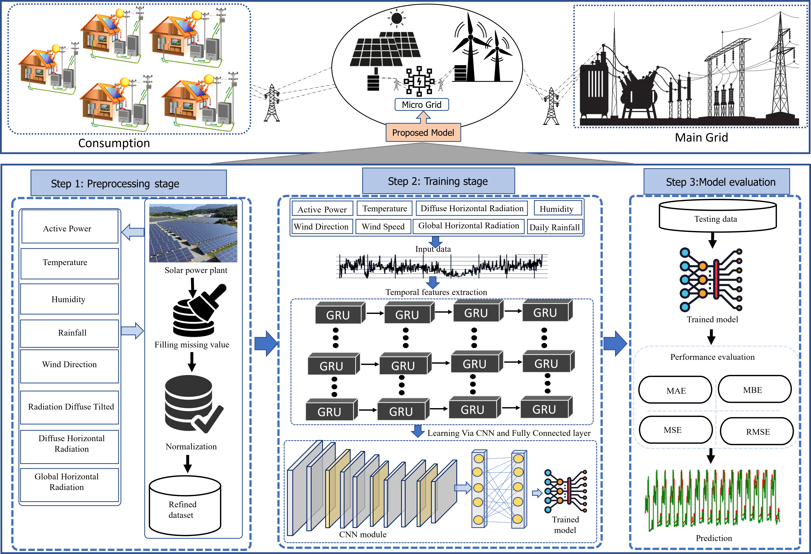

[# Hybrid-Deep-Learning-Network-for-Photovoltaic-Power-Forecasting][https://www.hindawi.com/journals/complexity/2022/7040601/]

## Abstract
For efficient energy distribution, microgrids (MG) provide significant assistance to main grids and act as a bridge between the power generation and consumption. Renewable energy generation resources, particularly photovoltaics (PVs), are considered as a clean source of energy but are highly complex, volatile, and intermittent in nature making their forecasting challenging. Thus, a reliable, optimized, and a robust forecasting method deployed at MG objectifies these challenges by providing accurate renewable energy production forecasting and establishing a precise power generation and consumption matching at MG. Furthermore, it ensures effective planning, operation, and acquisition from the main grid in the case of superior or inferior amounts of energy, respectively. Therefore, in this work, we develop an end-to-end hybrid network for automatic PV power forecasting, comprising three basic steps. Firstly, data preprocessing is performed to normalize, remove the outliers, and deal with the missing values prominently. Next, the temporal features are extracted using deep sequential modelling schemes, followed by the extraction of spatial features via convolutional neural networks. These features are then fed to fully connected layers for optimal PV power forecasting. In the third step, the proposed model is evaluated on publicly available PV power generation datasets, where its performance reveals lower error rates when compared to state-of-the-art methods.
## Proposed Framework 

## Access to Our Dataset

Hello there! :wave:

Thank you for your interest in our datasets. Due to size limitations on GitHub, we haven't uploaded the entire dataset directly. 

:email: If you wish to access or use our datasets, please send a request to the following email, and we'll provide you with further instructions:
**altafh3797@gmail.com**

We appreciate your understanding and patience. Looking forward to assisting you!

Best regards,
ALTAF HUSSAIN

